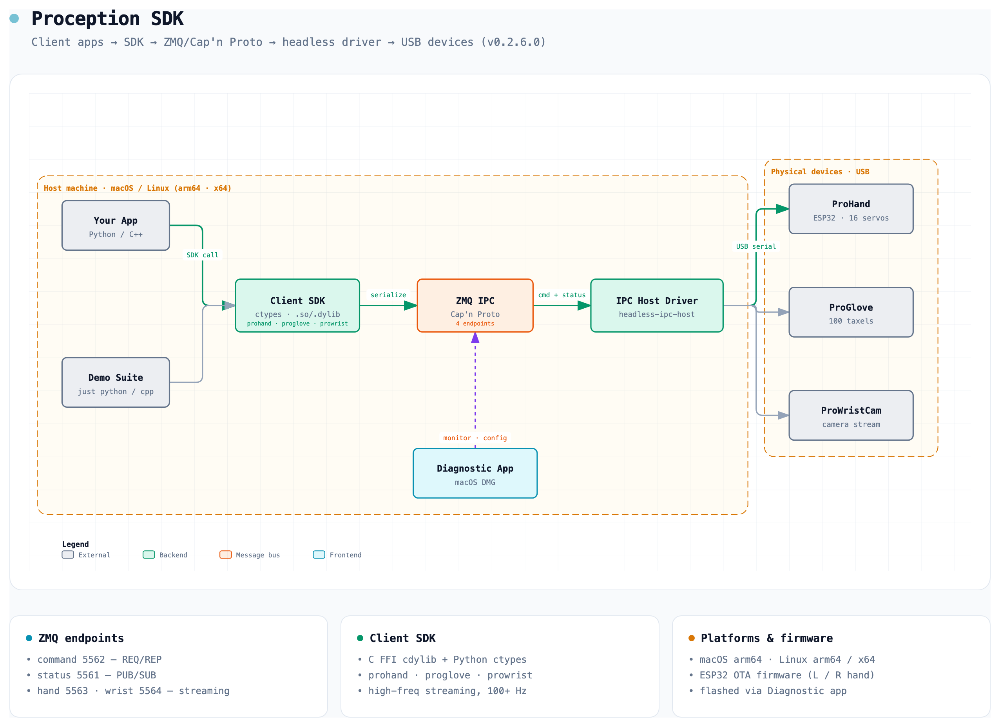

# Proception SDK

Official SDK and drivers for the **ProHand** robotic hand, the **ProGlove**
tactile sensing glove, and the **ProWristCam**.

**Current Version**: 0.3.0.0

The SDK is a C FFI dynamic library (`cdylib`) with ready-to-use **Python**
(`ctypes`) and **C++** bindings. Your application talks to a small headless
driver over a local ZeroMQ / Cap'n Proto bus; the driver owns the USB link to
the hardware.

## Architecture



```
┌──────────────┐   ZMQ /        ┌────────────────────┐   USB    ┌──────────┐
│  Your app    │   Cap'n Proto  │  headless IPC host │  serial  │  Device  │
│ (Python/C++) │ ─────────────► │      (driver)      │ ───────► │ hardware │
└──────────────┘                └────────────────────┘          └──────────┘
      SDK (cdylib + bindings)
```

Your application calls the **Client SDK**, which serializes commands with
**Cap'n Proto** and sends them over the **ZMQ IPC** bus. The **headless IPC
host** (one per device family) consumes that bus and drives the USB device over
serial. Status and high-rate streaming flow back on separate channels.

### Devices

| Device | What it is | Notable capabilities |
|--------|-----------|----------------------|
| **ProHand** | 22-DoF robotic hand (18 active + 4 pseudo-active) | 16 rotary servos, 2 linear actuators, 2 wrist joints; high-level per-finger joint control (5 fingers × 4 joints) with on-device inverse kinematics |
| **ProGlove** | Tactile sensing glove | 100 taxels across fingers + palm, plus IMU |
| **ProWristCam** | Wrist-mounted camera | JPEG frame stream |

### ZMQ endpoints (ProHand, default TCP)

| Port | Channel | Pattern |
|------|---------|---------|
| 5562 | command | REQ/REP |
| 5561 | status | PUB/SUB |
| 5563 | hand streaming | PUB/SUB |
| 5564 | wrist streaming | PUB/SUB |

The driver also exposes local **IPC** endpoints (e.g.
`ipc:///tmp/prohand-commands.ipc`), which are the fastest transport on a single
host. ProGlove uses a single status endpoint per hand (TCP `5566` left / `5576`
right). High-frequency streaming runs at 100+ Hz over the PUB/SUB channels.

Hosts are supported on macOS / Linux (arm64 · x64).

## Repository Layout

The SDK and driver binaries ship **unpacked** (not zipped) so you can browse and
use them directly from the repo.

```
pro-sdk/
├── README.md              This file
├── INDEX.md               Release information
├── MANIFEST.txt           Checksums and file details
├── CHANGELOG.md           Version history
├── CONTRIBUTING.md        Contribution guidelines
├── SECURITY.md            Security policy
├── LICENSE                License
├── docs/                  Shared documentation and assets
├── sdk/                   SDK source, libraries, demos, and docs
│   ├── prohand_sdk/       ProHand SDK   (lib/, cpp/, python/)
│   ├── proglove_sdk/      ProGlove SDK  (lib/, cpp/, python/)
│   ├── prowrist_sdk/      ProWristCam SDK (lib/, cpp/, python/)
│   ├── demo/              Example applications (python/, cpp/)
│   ├── docs/              API.md, EXAMPLES.md
│   └── README.md          SDK usage guide
└── driver/                Headless IPC host binaries (unpacked, per platform)
    ├── macos-arm64/       macOS Apple Silicon
    ├── linux-arm64/       Linux ARM64 (Jetson Orin, ARM servers)
    ├── linux-x64/         Linux x64 (Intel/AMD)
    └── udev/              Linux udev rules + installer
```

Each `driver/<platform>/` folder contains:

- `prohand-headless-ipc-host` — ProHand driver
- `proglove-headless-ipc-host` — ProGlove driver
- `prowristcam-headless-ipc-host` — ProWristCam driver
- `udcap-ctrl` — UDP capture control for dual-arm systems
- `VERSION`, `PLATFORM`

## Quick Start

### 1. Start the driver

Pick the folder for your host and launch the headless IPC host for your device.
It auto-detects the connected device, opens the ZMQ endpoints, and begins
streaming status.

```bash
cd driver/macos-arm64          # or linux-arm64 / linux-x64
./prohand-headless-ipc-host    # or proglove- / prowristcam-
```

On **Linux**, install the udev rules once so the device is accessible without
root, then unplug/replug:

```bash
cd driver/udev
./install-udev-rules.sh        # --check to inspect, --remove to uninstall
```

### 2. Talk to it from your app

**Python** — the library is auto-discovered from `../lib/`; override with the
`PROHAND_SDK_LIB` environment variable if needed.

```bash
cd sdk/prohand_sdk/python
pip install -e .
```

```python
from prohand_sdk import ProHandClient, discover_usb_devices, get_version

print("SDK", get_version())
print("Devices:", discover_usb_devices())

# Endpoints: command, status, hand-streaming, wrist-streaming
with ProHandClient(
    "tcp://127.0.0.1:5562",
    "tcp://127.0.0.1:5561",
    "tcp://127.0.0.1:5563",
    "tcp://127.0.0.1:5564",
) as client:
    client.send_ping()

    # High-level hand pose: 20 joints (5 fingers × 4), torque 0..1
    open_hand = [0.0] * 20
    client.send_hand_command(open_hand, torque=0.45)

    # High-frequency streaming (100+ Hz)
    client.set_streaming_mode(True)
    client.wait_for_streaming_ready()
    client.send_hand_streams(open_hand, torque=0.45)

    # Non-blocking status poll
    status = client.try_recv_status()
    if status and status.is_valid:
        print("rotary:", status.rotary_positions)
```

**C++** — RAII wrapper over the same C API.

```bash
cd sdk/prohand_sdk/cpp
mkdir build && cd build && cmake .. && make
```

```cpp
#include <prohand_sdk/ProHandClient.hpp>

prohand_sdk::ProHandClient client(
    "tcp://127.0.0.1:5562", "tcp://127.0.0.1:5561",
    "tcp://127.0.0.1:5563", "tcp://127.0.0.1:5564");
client.sendPing();
```

### 3. ProGlove and ProWristCam

```python
from proglove_sdk import ProGloveClient

# One status endpoint per hand (IPC or TCP)
with ProGloveClient("tcp://127.0.0.1:5566") as glove:
    status = glove.try_recv_status()       # 100 taxels, by segment
    imu = glove.try_recv_imu_status()

from prowrist_sdk import WristCamClient

with WristCamClient("ipc:///tmp/prowristcam-stream.ipc") as cam:
    frame = cam.try_recv_frame()           # JPEG frame, non-blocking
```

## SDK API at a glance

### ProHand (`ProHandClient`)

- **Connection**: `is_connected()`, `send_ping()`, `discover_usb_devices()`
- **High-level control** (per-finger joints, on-device IK):
  `send_hand_command(positions[20], torque)` /
  `send_hand_streams(positions[20], torque)`
- **Low-level control**: `send_rotary_commands` / `send_rotary_streams`
  (16 servos), `send_linear_commands` / `send_linear_streams` (2 actuators)
- **Wrist**: `send_wrist_command` / `send_wrist_streams` (2 joints, optional
  motion profiler), `set_wrist_limits`
- **Streaming**: `set_streaming_mode(bool)`, `wait_for_streaming_ready()`,
  `is_running_state()`
- **Calibration**: `send_zero_calibration(mask[16])`
- **Status**: `try_recv_status()` → `HandStatus` (rotary/linear positions and
  targets, raw `i16` at 0.01° precision)

### ProGlove (`ProGloveClient`)

- `send_ping()`, `calibrate()`, `set_denoise_enabled()`, `set_filter_enabled()`,
  `perform_ota(...)`
- `try_recv_status()` → `TactileStatus` (100 taxels by finger segment
  DIP/PIP/MCP + upper/middle/lower palm)
- `try_recv_imu_status()` → `ImuStatus`

### ProWristCam (`WristCamClient`)

- `is_connected()`, `try_recv_frame()` → `JpegFrame`

Every client supports context managers and raises typed errors
(`ConnectionError`, `InvalidArgumentError`, and the per-device base error).

## Demos

Runnable Python and C++ examples live in `sdk/demo/` (driven by `just`):

```bash
cd sdk/demo/python
just connect          # connection test
just ping             # latency test
just test-hand        # exercise each of the 16 rotary joints
just cyclic-motion    # sine-wave motion
just kapandji         # thumb-to-fingertip opposition (needs PyYAML)
just connect-glove left   # ProGlove connection
just test-glove left      # live tactile monitor (100 taxels)
```

C++ equivalents are under `sdk/demo/cpp` (`just build`, then `just connect`,
`just test-hand`, …). See `sdk/demo/README.md` for the full list.

## Documentation

- [SDK usage guide](sdk/README.md)
- [API reference](sdk/docs/API.md) · [Examples](sdk/docs/EXAMPLES.md)
- [Demo walkthrough](sdk/demo/README.md)
- [Release index](INDEX.md) · [Manifest](MANIFEST.txt) · [Changelog](CHANGELOG.md)

## Version Management

Versions are tracked with git tags:

```bash
git tag -l              # list versions
git checkout 0.3.0.0    # check out a specific release
```

## Platform Support

| Platform | SDK | Driver |
|----------|-----|--------|
| macOS ARM64 (M-series) | ✓ | ✓ |
| Linux ARM64 (Jetson) | ✓ | ✓ |
| Linux x64 | ✓ | ✓ |
| Windows x64 | ✗ | ✗ |

✗ Windows is not supported in the near term. Support may be considered upon
special request — contact contact@proception.ai.

## Support

- **Issues**: https://github.com/proception/pro-sdk/issues
- **Email**: contact@proception.ai
- **Contributing**: see [CONTRIBUTING.md](CONTRIBUTING.md)
- **Security**: see [SECURITY.md](SECURITY.md)

## License

See [LICENSE](LICENSE) for details.
